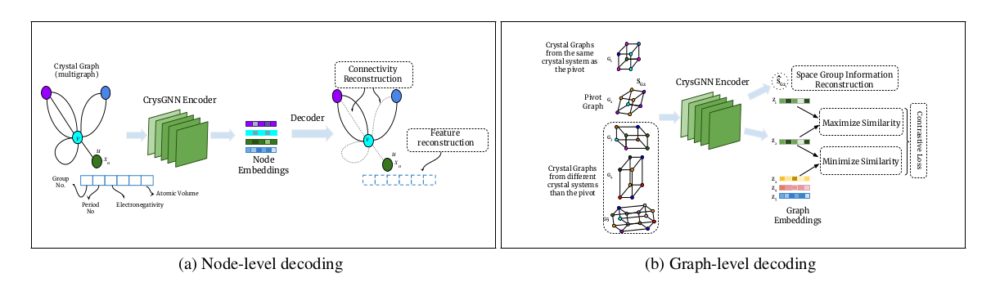
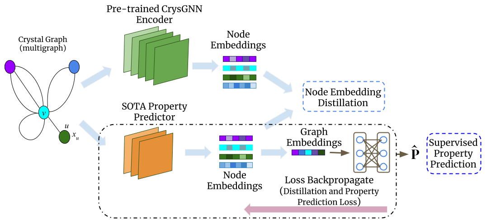

# CrysGNN : Crystal Graph Neural Network

This is software package for Crsytal Graph Neural Network(CrysGNN), a new pre-trained GNN framework for crystalline
materials, which captures both node and graph level structural information of crystal graphs using a huge amount of unlabelled material data. CrysGNN takes as input
any arbitary crystal structure in .cif file format and return node embeddings of the crystal graph structure. Using these embeddings, we extract distilled knowledge
from CrysGNN and inject into different state of the art property predictors to enhance their property prediction accuracy.
The following paper describes the details of the CrysGNN framework: <br/>
[CrysGNN: Distilling pre-trained knowledge to enhance property prediction for crystalline materials (AAAI-2023)](https://kdmsit.github.io/assets/pdf/CrysGNN_Full.pdf) 

- Pre-training CrysGNN : 
    
    <div align='center'><strong>Figure 1. Overview of both node and graph-level decoding methods for CrysGNN.</strong></div>
    
- Property Prediction using distilled knowledge from CrysGNN
    
    <div align='center'><strong>Figure 2. Overview of Property Prediction using Knowledge Distillation from CrysGNN.</strong></div>
    
## Table of Contents
- [Requirements](#requirements)
- [Usage](#usage)
  - [Dataset](#define-a-customized-dataset)
  - [Train CrysGNN Model](#train-crysgnn-model)
  - [How to use CrysGNN in property predictor](#how-to-use-crysgnn)
- [How to cite](#how-to-cite)

##  Requirements

The package requirements are listed in requirements.txt file. Create a virtual environment and run the following command to install dependencies in your virtual environment:

```bash
pip install -r requirements.txt
```

## Usage
### Dataset
#### Pre-training Dataset
We curated around 800K untagged crystal graph data from two popular materials databases, Materials Project (MP) and OQMD. 
You can download the data from the following github link :<br/>
[crystal_untagged_800K](https://github.com/kdmsit/crystal_untagged_800K)
#### Downstream Dataset
We evaluate the performance of different SOTA models with distilled knowledge from CrysGNN using two popular dataset :

- <b>Materials Project Dataset(MP 2018.6.1)</b> : MP 2018.6.1 consists of 69,239 materials with two properties namely bandgap and formation energy. We follow the training setup mentioned
by ALIGNN paper and use 60000, 5000, and 4239 crystals for raining, validation, and test set.
- <b>JARVIS Dataset</b> : JARVIS-DFT(2021.8.18) consists of 55,722 materials and we consider 19 properties for the downstream tasks. We follow the training setup mentioned
by ALIGNN paper and use 80%,10% and 10% raining, validation, and test splits
### Train CrysGNN Model
We have already trained crysgnn with 800K [Dataset](#define-a-customized-dataset) and a pretrained model (crysgnn_v1.pth) will be provided into the '../model' directory.

Yet, if You want to to train CrysGNN model from scratch by some other dataset, use the following procedure :

- Go to "crysgnn" directory
- Run the following command : 

```bash
python -W ignore pretrain.py --data-path <Data_Path> --epochs <num_epochs>
```
Please keep the materails in .cif file format. <br/>
During training, state of model at each epoch will be saved at "../model/" path.

### How to use CrysGNN in property predictor

In order to distill knowledge from CrysGNN and improve property prediction performance of your model, 
you need to follow the following procedure during training of your model : <br/>
- copy "crysgnn" folder into your model codebase
- Include following Code snippet into your training script <br/><br/>
```
    ## Import CrysGNN class
    from crysgnn.model import *
    
    ##Loading the CrysGNN model from checkpoints
    
    crysgnn_model = CrysGNN(64, nbr_fea_len, atom_fea_len, n_conv=5)
    checkpoint_file_path = "../model/crysgnn_state_checkpoint.pth.tar"
    checkpoint = torch.load(checkpoint_file_path)
    crysgnn_model.load_state_dict(checkpoint['state_dict'])
    criterion = nn.MSELoss()
    
    ##Computing Embedding Loss with your loss
    
    for <cif_file> in root_dir:
        loss,atom_emb = your_model(your parameters)
        
        ## CrysGNN takes input atom_fea, nbr_fea, nbr_fea_idx, crystal_atom_idx, which is similar to CGCNN model.
        _, _, _, _, crysgnn_atom_emb = crysgnn_model(atom_fea, nbr_fea, nbr_fea_idx, crystal_atom_idx,args.cuda)
        
        # Embedding Loss
        loss_emb = criterion(atom_emb,crysgnn_atom_emb)
        
        # Overall Loss
        loss = 0.5*loss + 0.5*loss_emb 
```
- Keep the hidden embedding dimension same for your_model and crysgnn_model(64).
We provide distilled version of cgcnn in the "distilled baslines" directory. You can follow it. 
For any further query, feel free to contact [Kishalay Das](kishalaydas@kgpian.iitkgp.ac.in)

## How to cite

If you have any query about CrysGNN, please contact me at [kishalaydas@kgpian.iitkgp.ac.in](kishalaydas@kgpian.iitkgp.ac.in)

## How to cite

If you are using CrysGNN, please cite our work as follow :

```
@article{Das_Samanta_Goyal_Lee_Bhattacharjee_Ganguly_2023, 
title={CrysGNN: Distilling Pre-trained Knowledge to Enhance Property Prediction for Crystalline Materials}, 
volume={37}, 
url={https://ojs.aaai.org/index.php/AAAI/article/view/25892}, 
DOI={10.1609/aaai.v37i6.25892}, number={6}, 
journal={Proceedings of the AAAI Conference on Artificial Intelligence}, 
author={Das, Kishalay and Samanta, Bidisha and Goyal, Pawan and Lee, Seung-Cheol and Bhattacharjee, Satadeep and Ganguly, Niloy}, 
year={2023}, month={Jun.}, pages={7323-7331} 
}
```

